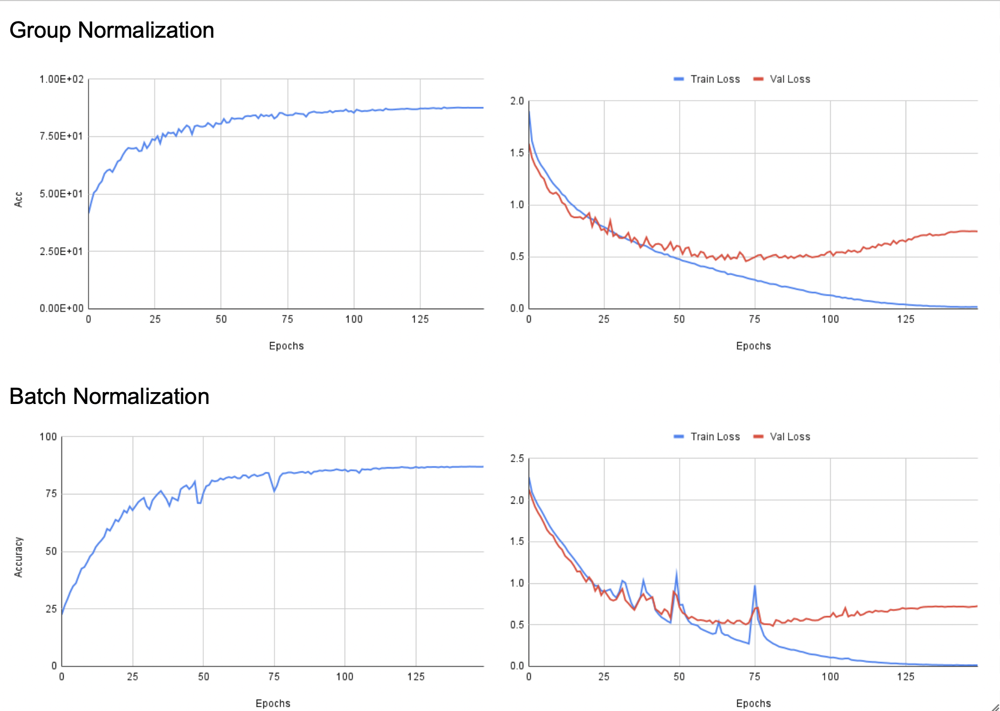
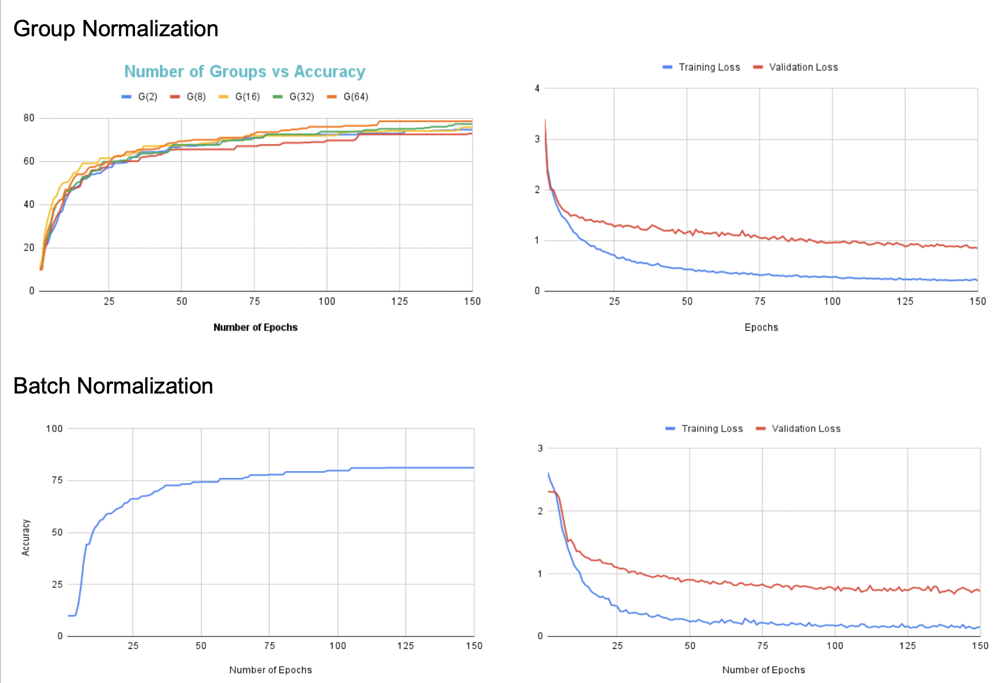

# Federated-Learning-Project

## Centralized training

| Model       | Normalization Layer | Number of Parameters | Accuracy / Link   |
| ----------- | ------------------- | -------------------- | ----------------- |
| ResNet-50   |        BN           |         23528522     |       86.91       |
| ResNet-50   |        GN           |         23528522     |       87.48       |

## Fed-Avg training

### IID Distribution 

| Model       | Normalization Layer | Accuracy / Link   |
| ----------- | ------------------- | ----------------- |
| ResNet-50   |        BN           |       81.14       |
| ResNet-50   |        GN           |       78.60       |

### Non-IID Distribution 

| Model       | Normalization Layer | Accuracy / Link   |
| ----------- | ------------------- | ----------------- |
| ResNet-50   |        BN           |       34.55       |
| ResNet-50   |        GN           |       51.01       |
