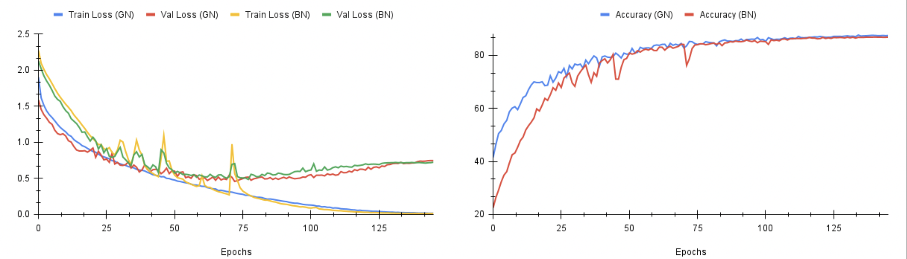
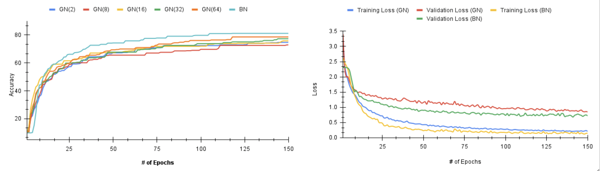
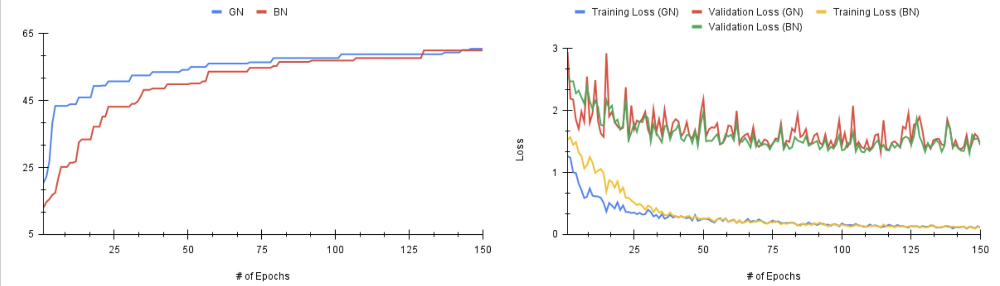
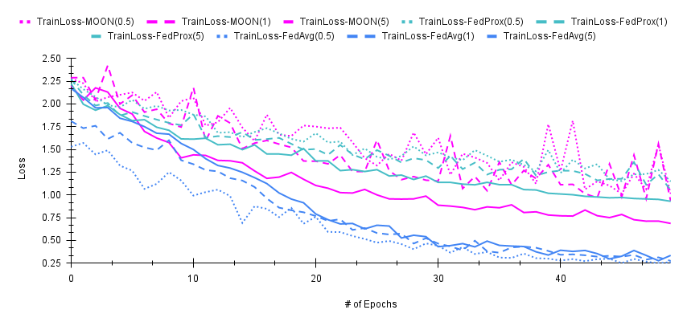
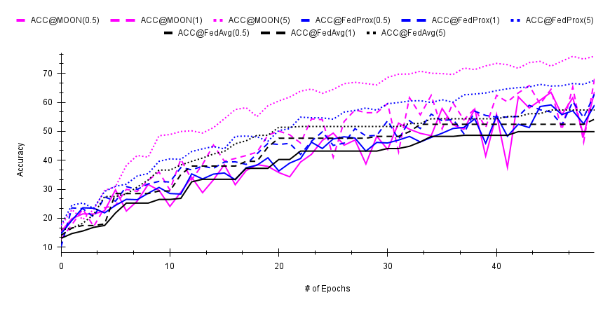

# Federated-Learning-Project

### Dependencies
* PyTorch >= 1.0.0
* torchvision >= 0.2.1
* scikit-learn >= 0.23.1

## [Centralized training](https://github.com/shyam671/Federated-Learning-Project/tree/main/code/Centralized-Baseline)

The maximum classification performance achived by the ResNet-50 when trained and validated on CIFAR-10 dataset.
This acts as the upper bound for all the below compared federated learning methods.

| Parameters  |  Network |  Dataset | Learning Rate | Batch-size | Epochs | Optimizer | Schedular |
| ----------- | -------- | -------- | ------------- | ---------- | ------ | ------ | ------ |
|  Values     |`ResNet50`| `CIFAR-10` | `1e-4`        | `256` | `150` | `Adam` | `OneCycleLR` | 

| Model       | Normalization Layer | Number of Parameters | Accuracy / Link   |
| ----------- | ------------------- | -------------------- | ----------------- |
| ResNet-50   |        BN           |         23528522     |       86.91       |
| ResNet-50   |        GN           |         23528522     |       87.48       |

## Federated Average

| Parameters  | # of clients | Learning Rate | Comm Rounds | Optimizer | Client-BatchSize | Client Epochs | Beta (NonIID) | Client Fraction |
| ----------- | ---------- | ------------- | ------ | ------ | ------ | ----- | ---- | ---------- |
|  Values     | `100` | `1e-4`      | `150` | `Adam` | `64` | `20` | `0.5` | `0.1` |

### IID Distribution 

| Model       | Normalization Layer | Accuracy / Link   |
| ----------- | ------------------- | ----------------- |
| ResNet-50   |        BN           |       81.14       |
| ResNet-50   |        GN           |       78.60       |

### Non-IID Distribution 

| Model       | Normalization Layer | Accuracy / Link   |
| ----------- | ------------------- | ----------------- |
| ResNet-50   |        BN           |       60.00       |
| ResNet-50   |        GN           |       60.51       |

## MOON (Model-Contrastive Federated Learning)
| Parameters  | # of clients | Learning Rate | Comm Rounds | Optimizer | Client-BatchSize | Client Epochs | Beta (NonIID) | Client Fraction |
| ----------- | ---------- | ------------- | ------ | ------ | ------ | ----- | ---- | ---------- |
|  Values     | `100` | `0.01`      | `50` | `SGD` | `64` | `5` | `0.5/1/5` | `0.1` |

| Method      | Accuracy @Beta=0.5  |  Accuracy @Beta=1  |   Accuracy @Beta=5  |  
| ----------- | ------------------- | -----------------  | -----------------   | 
| FedAvg      |        49.87        |        54.17       |   57.34             |
| FedProx     |        59.10        |        62.88       |   67.61             |
| MOON        |        63.62        |        68.23       |   75.93             | 

| Method      | # of Rounds @beta=0.5|  SpeedUp @beta=0.5  | # of Rounds @beta=1  |   SpeedUp @beta=1 | # of Rounds @beta=5  |   SpeedUp @beta=5 |
| ----------- | ------------------- | -----------------  | -----------------   | ------------------- | -----------------  | -----------------   |
| FedAvg      |        50           |        1x          |   50                |     1x              |      50            | 1x                  |
| FedProx     |        35           |        1.42x       |   34                | 1.47x | 27 | 1.85x |            
| MOON        |        25           |        2x          |   23                | 2.17x | 16 | 3.12x|

